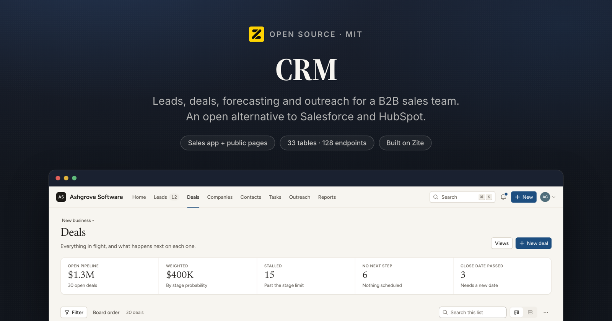
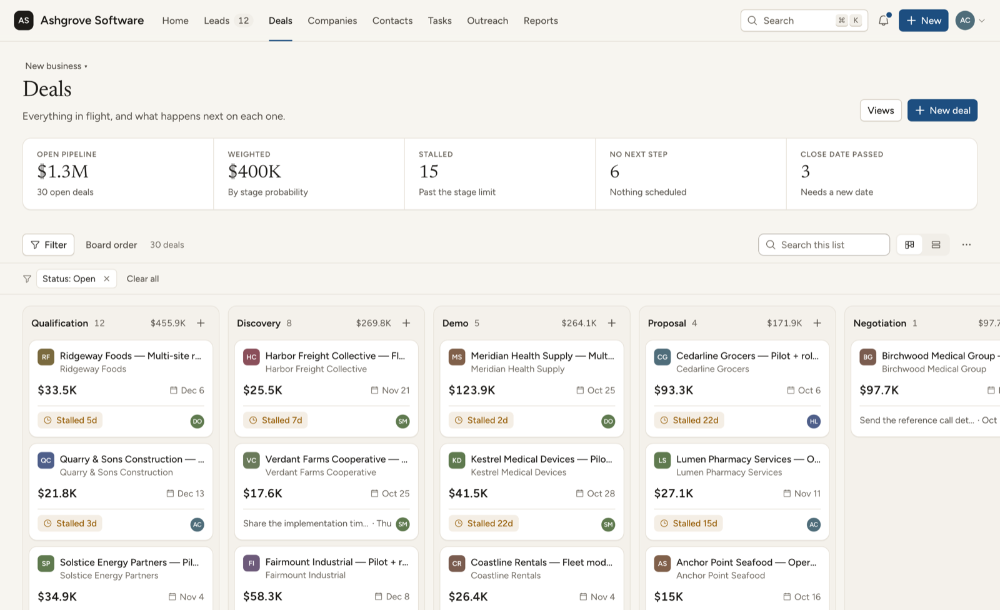
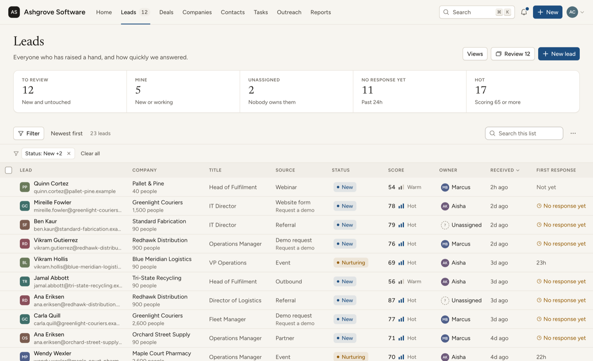
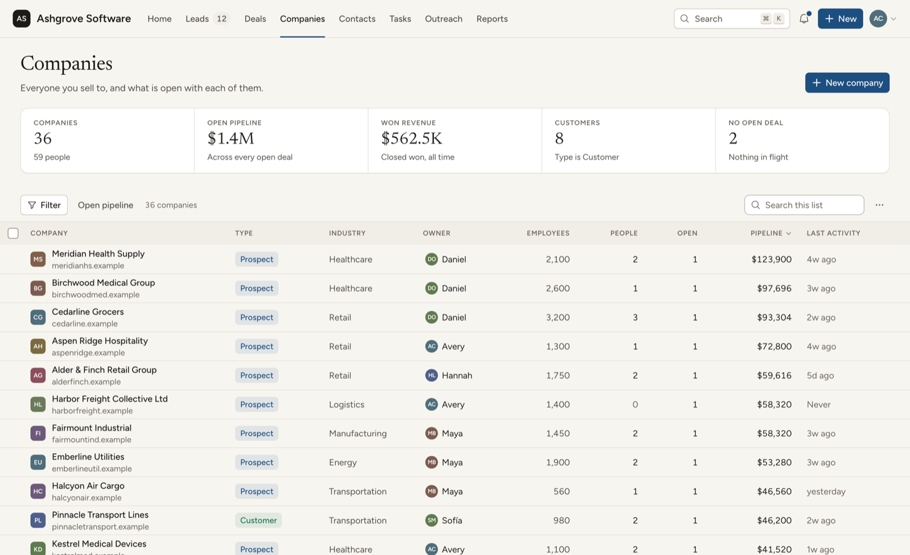
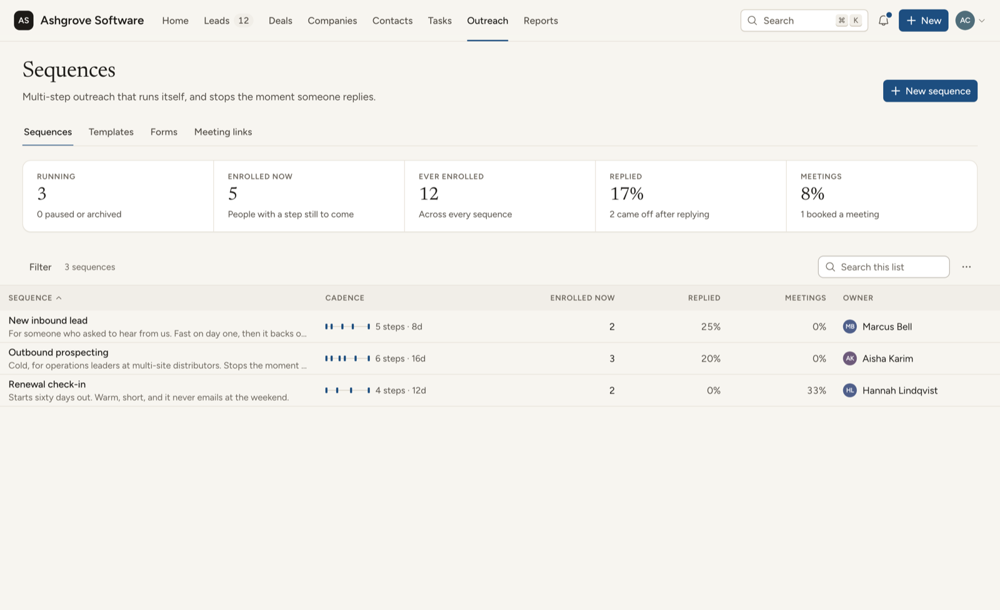
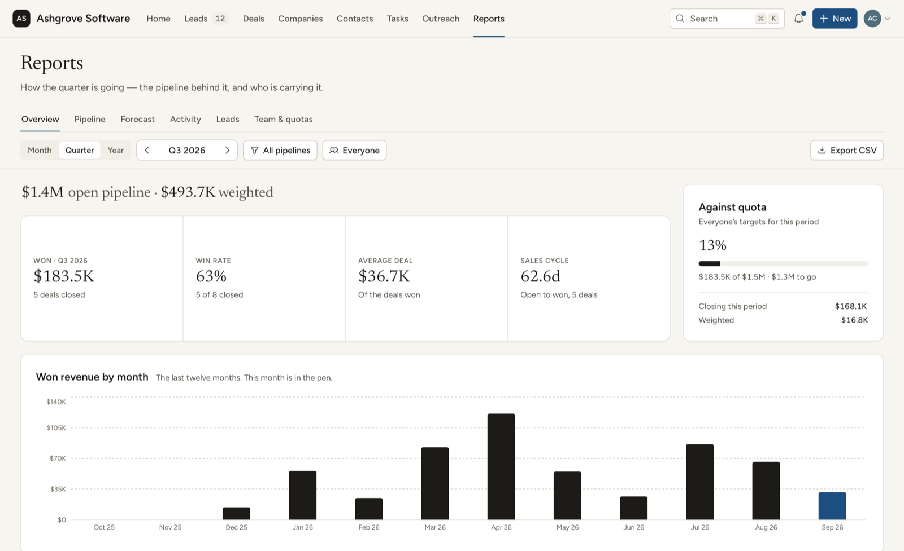

<p align="center">
  
</p>

<h3 align="center">CRM</h3>

<p align="center">
  Open-source B2B CRM: leads, deals, pipelines, forecasting and outreach.
  <br/>
  An open alternative to <b>Salesforce Sales Cloud</b> and <b>HubSpot Sales Hub</b>.
</p>

<p align="center">
  <a href="#whats-in-it">Features</a> ·
  <a href="#install-it-in-your-own-workspace">Install</a> ·
  <a href="#how-it-works">How it works</a> ·
  <a href="#local-development">Development</a> ·
  <a href="DESIGN.md">Design</a> ·
  <a href="BRIEF.md">Build brief</a>
</p>

<p align="center">
  <a href="LICENSE"></a>
  <a href="https://github.com/zite/crm/stargazers"></a>
  <a href="https://www.npmjs.com/package/zitejs"></a>
</p>

---

## What this is

A complete B2B CRM for a sales team of 5 to 100.

This is a **Zite solution**, meaning a workspace you install into your own
[Zite](https://zite.com) account and then edit. Zite provides the Postgres
database, the endpoint runtime, auth and hosting. Everything above that is the
~64,000 lines of TypeScript in this repository.

Two apps share one database:

| App | Directory | Who it's for | Access |
| --- | --- | --- | --- |
| **CRM** | `apps/crm` | The sales team: admins, managers, reps and read-only viewers | Internal (organization members) |
| **CRM Pages** | `apps/crm-pages` | Prospects and customers: web forms, meeting booking, quotes, unsubscribe | External (public) |

A fresh install opens empty, with a starter pipeline and pick lists ready for
your own records. To see it with work in it first, an admin can load a sample
organization from the bottom of **Settings → General**: Ashgrove Software, with
36 companies, about 60 contacts, about 70 deals across two pipelines and six
months of activity. **Settings → Sample data** removes it again.

<p align="center">
  
</p>

---

## What's in it

- **Leads.** an inbox of inbound and prospected people, scored and routed to a
  rep, worked through a one-at-a-time review deck, and converted into a
  company, a contact and a deal in one step.

  
- **Deals.** pipelines with stages you configure, a board you drag deals
  across, a sortable ledger, weighted forecasting, stalled-deal warnings, and a
  next step on every open deal.
- **Companies and contacts.** the records everything hangs off, with a
  timeline of every call, email, meeting and note, duplicate detection and
  merge, and custom fields per object.

  
- **Activities and tasks.** log a call in two keystrokes; a task queue that
  opens on what's due today; a meeting agenda; an activity log for the team.
- **Quotes and products.** a price book, line items that set a deal's amount,
  a quote builder, a PDF, and a public link the buyer accepts or declines.
- **Outreach.** email templates with merge fields, multi-step sequences that
  send and create tasks on a schedule, web forms that create leads, and public
  meeting links that book straight into the CRM.

  
- **Reports.** pipeline, forecast against quota, activity, lead conversion and
  team attainment, all computed in SQL.

  
- **Automations.** "when this happens, do that" rules over deals, leads,
  forms, meetings and quotes, with a run log.
- **Admin.** teammates and roles, teams, pipelines and stages, custom fields,
  pick lists and tags, lead routing, CSV import with undo, export, and sample
  data you can load into an empty workspace and remove again.
- **AI assists** (optional). A written brief on where a deal stands, email
  drafts, and follow-up tasks pulled out of meeting notes. Every one of them
  falls back to a non-AI version when no Anthropic connection is attached.

## Sample data

Nothing is loaded automatically. The first person to open a fresh install
becomes its Admin and lands in an empty CRM with a starter "Sales" pipeline and
the standard lost, disqualify and lead-source lists, so the first deal can be
created straight away.

While the workspace has no companies, contacts, deals or leads of its own, the
bottom of **Settings → General** offers to load **Ashgrove Software**, a B2B software
seller in Portland: 36 companies, about 60 contacts, about 70 deals across two
pipelines, six months of activity, tasks, leads, quotes, sequences, meeting
links and reports. Everything is generated from a fixed seed and dated relative
to today, and the admin who loads it is given a real slice of the work. It
never overwrites an organization name, address or footer you have already set.

**Settings → Sample data → Remove sample data** (in the nav only while the
sample is loaded) deletes all of it when a real team is ready to start. It keeps everything that was there before the sample
was loaded and anything added since, and once the workspace is empty again the
sample can be loaded again.

## Install it in your own workspace

Zite apps are built by pointing a coding agent at the platform over MCP, and
installing one works the same way.

**1. Connect the Zite MCP server to your agent.**

```bash
claude mcp add --transport http zite https://mcp.zite.com/mcp
```

(Cursor, VS Code and any other MCP client work the same way. See
[the Zite quickstart](https://developers.zite.com/quickstart).)

**2. Give it this prompt.**

> Install https://github.com/zite/crm into a new Zite workspace.
>
> 1. `create_workspace` named "CRM", then `create_sandbox` on it.
> 2. In the sandbox, add this repo as a git remote and check its files out over
>    `/workspace`, keeping the sandbox's own `zite.config.json`.
> 3. Read `zite.schema.json` and create all 33 tables with `create_table`, passing
>    each field's `definition` (`name`, `type`, `template`) straight through. Do this
>    **before** `create_app`, because `create_app` and `check_app` refresh
>    `zite.schema.json` from the live database, and would otherwise blank it.
> 4. `create_app` "CRM" (internal) and "CRM Pages" (external). Use those names
>    exactly: the directory is derived from the name, and these two produce
>    `apps/crm` and `apps/crm-pages`, which is what this repo already uses.
> 5. Run `yarn install`, so the workspace packages are linked and `@project/shared`
>    resolves.
> 6. `check_app` both apps, `commit`, then `publish_app` both.

**3. Open the CRM.** It opens empty, and you are its Admin. To look around with
records in it first, load the sample organization from the bottom of
**Settings → General**; when you are ready for real data, remove it from
**Settings → Sample data**, which deletes everything the sample created and
keeps anything you have added.

---

## How it works

A Zite workspace is **one database with one or more apps on top of it**. The split
that matters:

| Part | Where it runs |
| --- | --- |
| `apps/*/src/` minus `api/` | The browser. A normal Vite + React SPA. |
| `apps/*/src/api/*.ts` | Zite's endpoint runtime, server-side. One file = one endpoint. |
| `packages/*` | Imported by both. No build step; consumed as TypeScript source. |
| `.zite/` | Generated clients: typed DB access and a typed caller. Never edited by hand. |

The frontend never touches the database. It calls endpoints through a generated
typed client (`import { listDeals } from 'zitejs/api'`), and endpoints reach the
database through another (`import { zite } from 'zitejs/db'`). 128 endpoints: 117
in the CRM and 11 serving the public pages.

Where to look:

- **[DESIGN.md](DESIGN.md)** is the design language: density, tokens, vocabulary,
  patterns. Read it before touching the UI.
- **[BRIEF.md](BRIEF.md)** is how the code is organised, the platform's runtime
  rules (SQL identifiers, unset text, rate limits) and the server engine.
- **`packages/shared`** holds the rules used by both apps and every endpoint:
  money, dates, roles, merge fields, deal and quote arithmetic, and the server
  engine (`server/deals.ts`, `activities.ts`, `tasks.ts`, `events.ts`,
  `notify.ts`, `email.ts`, `automations.ts`, `sequences.ts`).
- **`apps/crm/src/ui`**, `glyphs`, `pickers`, `records`, `timeline` are the kit
  every screen is built from.
- **`scripts/check-contrast.mjs`** measures every colour pair in both themes. Run
  it after any palette change.

---

## Local development

```bash
yarn install
cp .env.example .env.local   # then put your own workspace id in it
yarn dev                     # the CRM on :8080
yarn dev:crm-pages           # public pages on :8081
```

**What works offline:** the whole frontend, `tsc`, and `vite build`. Editing a
component hot-reloads.

**What does not:** the endpoints in `src/api/` execute on Zite's runtime against
your workspace database, not on your machine. `yarn dev` serves the UI, but every
endpoint call goes out to the workspace named in `.env.local` and needs a session
for that organization. There is no local database mode yet.

Run `yarn generate` after adding, renaming or deleting an endpoint.

```bash
yarn run check   # tsc + endpoint bundling + vite build, both apps
```

> **Note.** On an app this size `zitejs check` prints `bundle endpoints ✗` with no
> error and exits non-zero. That is a 1 MB stdout buffer in the checker, not a real
> failure. To see genuine endpoint errors, bundle to a file instead:
> `npx zitejs bundle --app crm > /tmp/b.json` and read `endpointErrors`.

---

## Tech stack

React 18 · TypeScript · Vite · Tailwind CSS 3 · [shadcn/ui](https://ui.shadcn.com) ·
Radix · TanStack Query & Table · Recharts · dnd-kit · date-fns · zod ·
[zitejs](https://github.com/zite/zitejs) (database, endpoints, auth, email, PDF,
uploads, schedules) · [Claude](https://www.anthropic.com) for the optional AI assists.

## Contributing

Issues and pull requests are welcome. See [CONTRIBUTING.md](CONTRIBUTING.md), and
read [DESIGN.md](DESIGN.md) before changing UI. Anything security-related goes to
[SECURITY.md](SECURITY.md) instead of a public issue.

## License

MIT. See [LICENSE](LICENSE). Third-party notices in [NOTICE](NOTICE).
